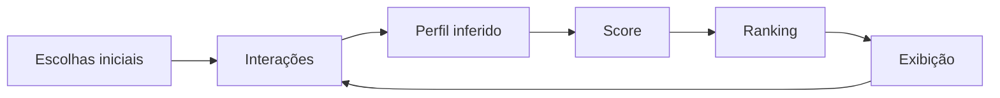

<p align="center">
  
</p>

<p align="center">
  <a href="https://recommendation-algorithm-simulator.vercel.app"><strong>Demo</strong></a> •
  <a href="https://github.com/sandrozdb"><strong>GitHub</strong></a> •
  <a href="https://linkedin.com/in/sandrozdb"><strong>LinkedIn</strong></a> •
  <a href="https://sandrozdb.com"><strong>Portfólio</strong></a> •
  <a href="mailto:sandrozdb@gmail.com"><strong>E-mail</strong></a>
</p>

# Recommendation Lab — Recommendation Algorithm Simulator

Simulador didático de sistemas de recomendação criado para tornar visível como **comportamentos geram sinais, sinais alteram scores e scores reorganizam rankings**.

A experiência foi inspirada em princípios que a **Netflix descreve publicamente** sobre personalização, mas os pesos, scores e regras desta aplicação são inteiramente educacionais e **não reproduzem o algoritmo real da Netflix**.

> **Status:** MVP funcional, responsivo, sem backend e publicado na Vercel.

> Projeto criado por **Sandro Ferreira** como apoio a uma apresentação executiva sobre algoritmos, comportamento e personalização.

## Problema

Plataformas digitais precisam reduzir universos enormes de opções para pequenas listas relevantes. Para o usuário, a tela parece simples; por trás dela, sistemas observam sinais, estimam relevância, ordenam candidatos e aprendem com novas interações.

O desafio deste projeto é explicar esse processo sem depender de fórmulas abstratas ou código complexo durante uma apresentação.

## Solução

O **Recommendation Lab** transforma o conceito em uma experiência interativa:

1. o usuário escolhe três títulos para iniciar o perfil;
2. o sistema cria um ranking inicial;
3. ações como assistir, finalizar, gostar, amar, rejeitar ou abandonar viram sinais;
4. o perfil de interesses é atualizado;
5. o ranking é recalculado em tempo real;
6. a tela **Raio-X** explica por que cada título ganhou determinada posição.

## Demo

**Aplicação publicada:**  
[recommendation-algorithm-simulator.vercel.app](https://recommendation-algorithm-simulator.vercel.app)

Para testar localmente, basta servir os arquivos estáticos:

```bash
npm run serve
```

ou abrir com qualquer servidor HTTP local.

## Fluxo de funcionamento



A ideia central é simples:

> **Cada escolha também vira dado para a próxima escolha.**

## Funcionalidades

- cold start com escolha de três títulos;
- ranking personalizado em tempo real;
- ações positivas e negativas;
- perfil de interesses inferido;
- fileira baseada em similaridade;
- fileira de exploração/diversidade;
- botão **“Por que estou vendo isso?”**;
- decomposição do score por componente;
- tela **Raio-X do algoritmo**;
- histórico de sinais;
- controle de diversidade do ranking;
- persistência local no navegador;
- botão para resetar a demonstração;
- layout responsivo para desktop e mobile.

## Como o score didático funciona

Cada título recebe pontos a partir de quatro dimensões:

| Componente | Papel na simulação |
|---|---|
| Similaridade | Afinidade entre gêneros/tags do conteúdo e o perfil inferido |
| Popularidade | Sinal global do título |
| Recência | Reforço para interesses positivos recentes |
| Exploração | Incentivo a conteúdos fora dos interesses dominantes |

Sinais negativos podem reduzir a pontuação. O usuário pode aumentar ou reduzir a diversidade para visualizar como **mudar o objetivo muda o ranking**.

> Os pesos são ilustrativos. O score não é uma probabilidade real de clique, visualização ou satisfação.

## O que a Netflix divulga publicamente

Segundo a Central de Ajuda da Netflix, o sistema de recomendações considera fatores como:

- interações com o serviço e histórico de visualização;
- avaliações de títulos;
- assinantes com gostos similares;
- gênero, categorias, atores e ano de lançamento;
- horário de uso;
- idioma preferido;
- dispositivo;
- duração assistida.

A Netflix também informa que interações mais recentes tendem a influenciar mais as recomendações e que a página inicial pode personalizar **quais fileiras aparecem, quais títulos entram em cada fileira e a ordem desses títulos**.

Fonte oficial: [Como funciona o sistema de recomendações da Netflix](https://help.netflix.com/pt/node/100639)

## Limitações e disclaimer

Este projeto:

- não é afiliado, patrocinado ou endossado pela Netflix;
- não reproduz código, modelos, pesos ou regras proprietárias da Netflix;
- utiliza títulos conhecidos apenas como exemplos didáticos e não utiliza pôsteres oficiais;
- não coleta dados em servidor;
- não utiliza informações demográficas;
- simplifica conceitos de recomendação para fins de apresentação e aprendizado.

## Privacidade

A aplicação não possui autenticação, banco de dados ou backend. As escolhas ficam somente no `localStorage` do navegador e podem ser apagadas a qualquer momento por **Resetar demo**.

## Tecnologias

| Tecnologia | Uso |
|---|---|
| HTML5 | Estrutura da aplicação |
| CSS3 | Interface responsiva e visual do simulador |
| JavaScript ES Modules | Estado, interações e renderização |
| Node.js `node:test` | Testes automatizados da lógica |
| Vercel | Hospedagem estática |
| GitHub | Versionamento e documentação |

## Estrutura

```text
recommendation-algorithm-simulator/
├── index.html
├── styles.css
├── package.json
├── vercel.json
├── LICENSE
├── .gitignore
├── assets/
│   ├── cover.svg
│   └── favicon.svg
├── src/
│   ├── app.js
│   ├── data.js
│   └── recommender.js
├── tests/
│   └── recommender.test.mjs
└── docs/
    ├── architecture.md
    ├── methodology.md
    └── demo-script.md
```

## Testes

A lógica principal possui testes com `node:test`.

```bash
npm test
```

Os testes validam:

- inferência inicial de interesse;
- efeito de sinal negativo;
- alteração do ranking após interações;
- limites do controle de diversidade.

## Roteiro de apresentação

O roteiro de 3 minutos para a demonstração está em [`docs/demo-script.md`](docs/demo-script.md).

## Arquitetura e metodologia

- [`docs/architecture.md`](docs/architecture.md) — arquitetura e componentes;
- [`docs/methodology.md`](docs/methodology.md) — fidelidade conceitual, fonte pública e limitações.

## Autor

**Sandro Ferreira**  
Engenharia da Computação • IA • Dados • Automação

- GitHub: [@sandrozdb](https://github.com/sandrozdb)
- LinkedIn: [linkedin.com/in/sandrozdb](https://linkedin.com/in/sandrozdb)
- Portfólio: [sandrozdb.com](https://sandrozdb.com)
- E-mail: [sandrozdb@gmail.com](mailto:sandrozdb@gmail.com)

---

Se este projeto te ajudou a entender sistemas de recomendação de forma mais concreta, deixe uma ⭐ no repositório.
