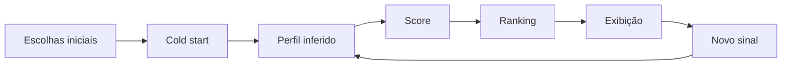

<p align="center">
  
</p>

<p align="center">
  <a href="https://github.com/sandrozdb/recommendation-algorithm-simulator/actions/workflows/ci.yml"></a>
  <a href="LICENSE"></a>
  <a href="https://recommendation-algorithm-simulator.vercel.app"></a>
  
</p>

<p align="center">
  <a href="https://recommendation-algorithm-simulator.vercel.app"><strong>Abrir demo</strong></a> ·
  <a href="docs/architecture.md"><strong>Arquitetura</strong></a> ·
  <a href="docs/methodology.md"><strong>Metodologia</strong></a> ·
  <a href="docs/demo-script.md"><strong>Roteiro da demo</strong></a>
</p>

# Recommendation Lab — Recommendation Algorithm Simulator

Simulador interativo que torna visível o ciclo de um sistema de recomendação: **comportamento gera sinais, sinais alteram o perfil inferido, o perfil altera scores e os scores reorganizam o ranking**.

A aplicação foi criada para explicar recomendação e personalização de forma visual, sem depender de fórmulas abstratas durante uma apresentação. Ela se inspira em princípios descritos publicamente pela Netflix, mas **não reproduz algoritmos, pesos ou modelos proprietários**.

> **Status:** demo funcional, responsiva, publicada na Vercel, com testes automatizados e execução 100% client-side.

## Demo ao vivo

**https://recommendation-algorithm-simulator.vercel.app**

O fluxo recomendado para testar é:

1. escolha **3 títulos** no cold start;
2. crie o primeiro ranking;
3. abra uma recomendação e gere um novo sinal;
4. observe outro conteúdo assumir o topo;
5. abra o **Raio-X** para ver perfil, sinais e score;
6. altere a diversidade para visualizar como mudar o objetivo muda o ranking.

## O problema

Plataformas digitais precisam transformar catálogos enormes em poucas opções relevantes para cada pessoa. Para quem usa o produto, a tela parece simples; por trás dela existe um ciclo de seleção, inferência, score, ordenação e aprendizado com novos sinais.

O desafio deste projeto é tornar esse ciclo **observável e explicável**.

## A solução

O Recommendation Lab implementa uma experiência didática completa:



Depois que um título recebe um novo sinal, ele continua influenciando o perfil, mas sai do conjunto principal de candidatos. Assim, o sistema usa o que aprendeu com aquele comportamento para escolher **a próxima recomendação ainda não consumida**.

## Principais funcionalidades

- **cold start** com três escolhas iniciais;
- primeiro ranking criado a partir desses sinais;
- ações como `10 min`, `Até o fim`, `Gostei`, `Amei`, `Não é para mim` e `Abandonei`;
- perfil de interesses inferido em escala relativa de **0 a 100**;
- ranking recalculado após novos sinais;
- indicador visual de títulos que subiram ou desceram posições;
- remoção de títulos já consumidos do ranking principal;
- explicação **“Por que estou vendo isso?”**;
- tela **Raio-X** com decomposição do score;
- histórico dos últimos sinais;
- controle de diversidade entre afinidade e exploração;
- persistência local no navegador;
- reset completo da demonstração;
- layout adaptado para desktop, apresentações e telas menores.

## Modelo didático de score

O ranking usa quatro componentes visíveis. O **Total é literalmente a soma deles**:

```text
Total = Similaridade + Popularidade + Recência + Exploração
```

| Componente | Faixa | O que representa |
|---|---:|---|
| **Similaridade** | 0–55 | afinidade entre gêneros/tags e o perfil inferido |
| **Popularidade** | 0–20 | força global do título no catálogo didático |
| **Recência** | 0–10 | proximidade com interesses positivos recentes |
| **Exploração** | 0–15 | incentivo a conteúdos fora dos interesses dominantes |
| **Total** | **0–100** | soma exata dos quatro componentes |

Sinais negativos, repetição e escolhas iniciais podem reduzir a **Similaridade**. Essas penalidades ficam incorporadas nesse componente para que não existam ajustes escondidos depois da soma mostrada no Raio-X.

> O score é didático. Ele **não representa probabilidade real** de clique, visualização, retenção ou satisfação.

## Diversidade do ranking

O controle de diversidade permite demonstrar um ponto importante: **o mesmo perfil pode produzir rankings diferentes quando o objetivo do sistema muda**.

- mais afinidade → prioriza conteúdos próximos ao padrão conhecido;
- mais exploração → aceita mais variedade fora do padrão dominante.

O perfil do usuário continua o mesmo; o que muda é a estratégia de ordenação.

## O que é baseado em princípios públicos

A documentação pública da Netflix descreve sinais como:

- histórico e avaliações de títulos;
- assinantes com gostos semelhantes;
- gênero, categorias, atores e ano de lançamento;
- horário de uso;
- idioma preferido;
- dispositivo;
- tempo assistido.

Ela também descreve escolhas iniciais para perfis novos, maior influência de interações recentes e personalização da seleção e da ordem de títulos.

**Fonte:** [Como funciona o sistema de recomendações da Netflix](https://help.netflix.com/pt/node/100639)

## O que é simulado

Os seguintes elementos foram criados exclusivamente para fins educacionais:

- pesos das interações;
- fórmula e distribuição do score;
- popularidade dos itens do catálogo;
- regras de diversidade e exploração;
- perfil inferido exibido no Raio-X;
- artes visuais que representam os títulos.

O projeto não é afiliado, patrocinado ou endossado pela Netflix.

## Arquitetura

A aplicação é **100% client-side**:

```text
Navegador
│
├── Catálogo e pesos             src/data.js
├── Motor de recomendação        src/recommender.js
├── Estado e interface           src/app.js
├── Explicabilidade da demo      src/demo-enhancements.js
├── Perfil 0–100                 src/profile-scale.js
├── Acabamento de apresentação   src/presentation-polish.js
├── Clareza do ranking           src/ranking-clarity.js
├── UX do cold start             src/onboarding-scroll-fix.js
└── Persistência local           localStorage
```

Não existe API, autenticação, banco de dados ou processamento no servidor.

Detalhes: [`docs/architecture.md`](docs/architecture.md).

## Privacidade

As interações ficam somente no `localStorage` do navegador. A aplicação não envia histórico de uso para um backend e o estado pode ser apagado pelo botão **Resetar demo**.

## Decisões de projeto

- **Sem backend:** reduz dependências e risco durante demonstrações ao vivo.
- **Sem pôsteres oficiais:** evita depender de assets externos e mantém a identidade visual própria.
- **Artes didáticas:** os títulos são identificáveis, mas a interface não tenta reproduzir o trade dress de uma plataforma comercial.
- **Explicabilidade:** o Raio-X prioriza clareza sobre realismo algorítmico.
- **Score transparente:** os números mostrados na tabela fecham matematicamente no total apresentado.

## Tecnologias

| Tecnologia | Uso |
|---|---|
| HTML5 | estrutura da aplicação |
| CSS3 | interface, responsividade e experiência de apresentação |
| JavaScript ES Modules | estado, renderização e motor de recomendação |
| Node.js `node:test` | testes automatizados da lógica |
| GitHub Actions | integração contínua |
| Vercel | hospedagem estática |

## Testes e qualidade

A suíte usa apenas `node:test`, sem dependências externas.

```bash
npm test
```

Atualmente os testes validam:

- inferência de interesse a partir do cold start;
- efeito de sinais negativos;
- influência de interações positivas no ranking;
- saída de títulos já consumidos da próxima recomendação;
- invariável `Total = Similaridade + Popularidade + Recência + Exploração`;
- limites do controle de diversidade.

A workflow de **CI** executa os testes automaticamente em pushes e pull requests para `main`.

## Executar localmente

Pré-requisitos:

- navegador moderno;
- Python 3 para o servidor estático do script abaixo.

```bash
git clone https://github.com/sandrozdb/recommendation-algorithm-simulator.git
cd recommendation-algorithm-simulator
npm run serve
```

Depois abra:

```text
http://localhost:4173
```

Para executar somente os testes:

```bash
npm test
```

## Estrutura do repositório

```text
recommendation-algorithm-simulator/
├── .github/workflows/ci.yml
├── assets/
│   ├── cover.svg
│   └── favicon.svg
├── docs/
│   ├── architecture.md
│   ├── methodology.md
│   └── demo-script.md
├── src/
│   ├── app.js
│   ├── data.js
│   ├── recommender.js
│   ├── demo-enhancements.js
│   ├── profile-scale.js
│   ├── presentation-polish.js
│   ├── ranking-clarity.js
│   └── onboarding-scroll-fix.js
├── tests/
│   └── recommender.test.mjs
├── index.html
├── styles.css
├── styles-enhancements.css
├── presentation-polish.css
├── onboarding-scroll-fix.css
├── package.json
├── vercel.json
└── LICENSE
```

## Documentação

- [`docs/architecture.md`](docs/architecture.md) — arquitetura, módulos e score;
- [`docs/methodology.md`](docs/methodology.md) — base conceitual, limites e fidelidade;
- [`docs/demo-script.md`](docs/demo-script.md) — roteiro curto para demonstração ao vivo.

## Contexto do projeto

O Recommendation Lab nasceu como apoio visual para uma apresentação sobre **algoritmos, comportamento e personalização**. A ideia foi transformar uma explicação conceitual em uma experiência que permitisse enxergar, ao vivo, como novos sinais alteram o que ganha visibilidade.

## Licença

Distribuído sob a licença MIT. Consulte [`LICENSE`](LICENSE).

## Autor

**Sandro Ferreira**  
Engenharia da Computação · IA · Dados · Automação

[LinkedIn](https://linkedin.com/in/sandrozdb) · [GitHub](https://github.com/sandrozdb) · [Portfólio](https://sandrozdb.com)
