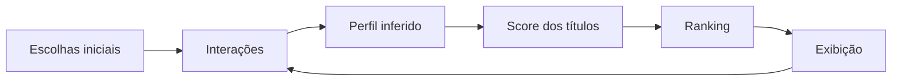

# Arquitetura

O Recommendation Lab foi construído como uma aplicação web **100% client-side**, sem backend, login ou banco de dados.

## Componentes

- `src/data.js` — catálogo didático e pesos de interação;
- `src/recommender.js` — inferência de perfil, score e ranking;
- `src/app.js` — estado, interação, views e renderização;
- `styles.css` — interface responsiva;
- `localStorage` — persistência apenas no navegador.

## Score didático

Cada item recebe um score de 0 a 100 combinando:

1. **Similaridade** — afinidade entre gêneros/tags do título e o perfil inferido;
2. **Popularidade** — sinal global do item;
3. **Recência** — proximidade com interações positivas recentes;
4. **Exploração** — incentivo controlado a conteúdos fora dos interesses dominantes.

Sinais negativos podem reduzir o score. O controle de diversidade altera a importância relativa de personalização e exploração.

> Os pesos foram criados exclusivamente para demonstração e não representam a fórmula real da Netflix.
