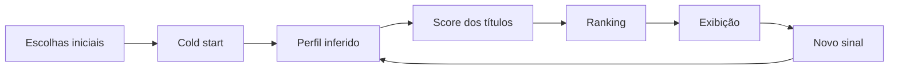

# Arquitetura

O **Recommendation Lab** é uma aplicação web **100% client-side**, sem backend, login ou banco de dados. O estado da demonstração é mantido no navegador e persistido em `localStorage`.

## Fluxo principal



Quando um título recebe um novo sinal, ele continua influenciando o perfil, mas deixa o conjunto principal de candidatos para que a próxima recomendação seja um conteúdo ainda não consumido.

## Componentes

| Arquivo | Responsabilidade |
|---|---|
| `src/data.js` | catálogo didático, metadados e pesos de interação |
| `src/recommender.js` | inferência de perfil, score, diversidade e ranking |
| `src/app.js` | estado, navegação, views, modais e renderização principal |
| `src/demo-enhancements.js` | explicações em linguagem humana e movimento no ranking |
| `src/profile-scale.js` | normalização visual do perfil inferido para escala 0–100 |
| `src/presentation-polish.js` | mensagens de apresentação e feedback visual de recálculo |
| `src/ranking-clarity.js` | clareza dos componentes do score e rótulos do Raio-X |
| `src/onboarding-scroll-fix.js` | comportamento de scroll e preservação de posição no cold start |
| `styles.css` | base visual e responsiva |
| `styles-enhancements.css` | estilos das melhorias didáticas |
| `presentation-polish.css` | acabamento de apresentação |
| `onboarding-scroll-fix.css` | layout específico da tela inicial |
| `localStorage` | persistência exclusivamente local |

## Modelo didático de score

O score final vai de **0 a 100** e é a soma exata de quatro componentes visíveis:

```text
Total = Similaridade + Popularidade + Recência + Exploração
```

| Componente | Faixa | Papel |
|---|---:|---|
| Similaridade | 0–55 | afinidade entre gêneros/tags e o perfil inferido |
| Popularidade | 0–20 | sinal global do título |
| Recência | 0–10 | reforço para interesses positivos recentes |
| Exploração | 0–15 | variedade controlada fora dos interesses dominantes |

Penalidades por sinais negativos, repetição e escolhas iniciais são incorporadas ao componente **Similaridade**. Assim, não existem ajustes escondidos depois da soma apresentada no Raio-X.

O controle de diversidade altera a relação entre personalização e exploração sem mudar a estrutura da fórmula.

## Estado e privacidade

A aplicação não envia interações para servidor. As escolhas ficam apenas no navegador e podem ser apagadas pelo botão **Resetar demo**.

## Decisões de projeto

- arquitetura estática para reduzir dependências durante a apresentação;
- ausência de autenticação e backend para manter a demonstração portátil;
- catálogo didático com artes próprias, sem depender de pôsteres oficiais;
- explicabilidade visual para tornar ranking e perfil inferido observáveis;
- separação entre lógica de recomendação e camada de apresentação.

> Os pesos e regras foram criados exclusivamente para demonstração e não representam a fórmula real de nenhuma plataforma comercial.
